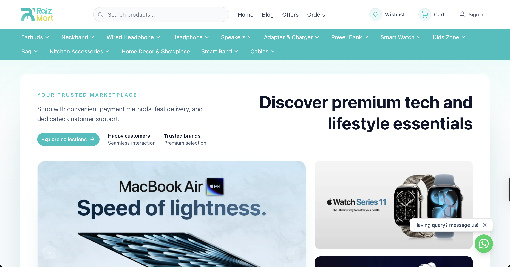
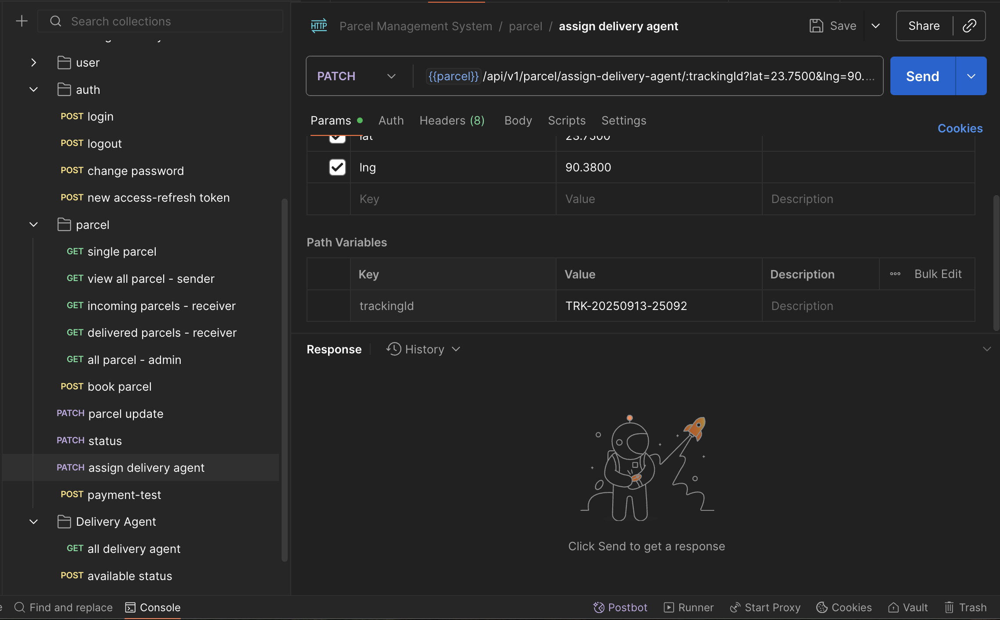
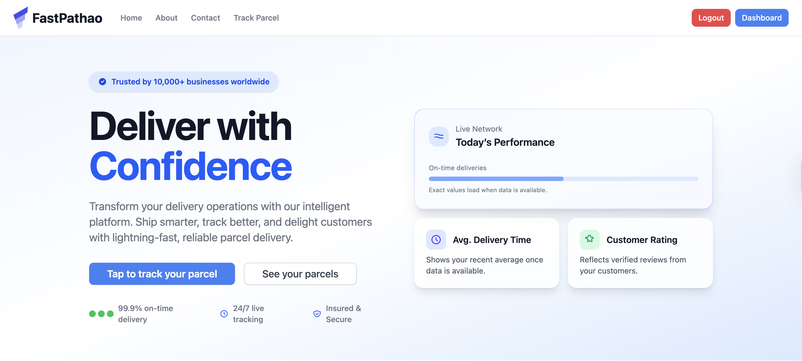
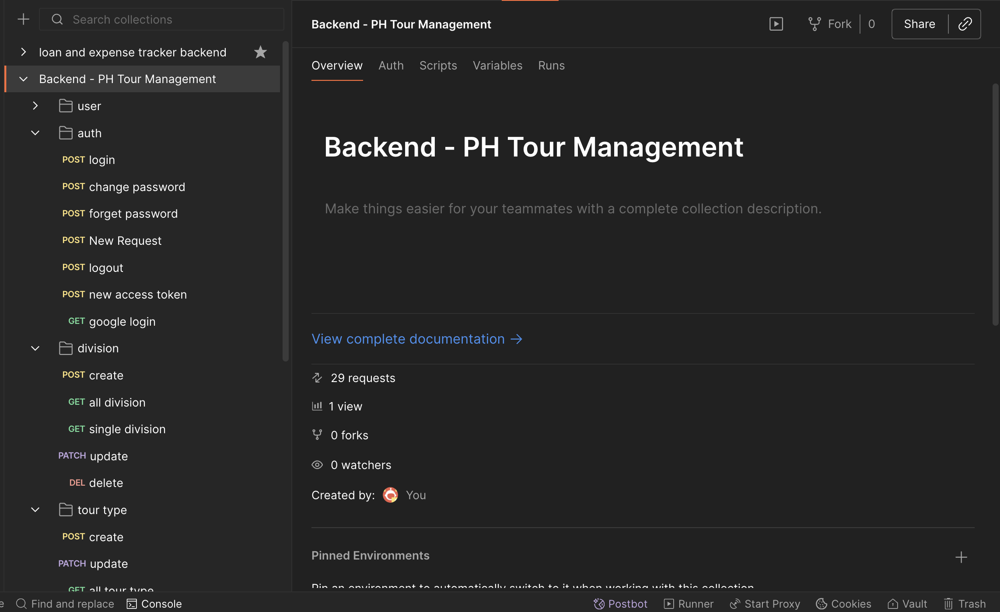

# LocalLens - Where travelers connect with local experiences

LocalLens is a high-performance tourism platform featuring **Next.js frontend** and **Node.js/Express backend**. It implements a dual-role ecosystem where **tourists discover and book tours while guides manage listings and real-time communications.**

**Performance & Scalability**: Optimized API latency by **~95%** and ensured **O(1) query scalability** using **Redis caching** (with smart versioning) and **cursor-based pagination** for deep-scrolling efficiency.

**Real-time Features**: Integrated **Socket.IO** for 1:1 instant messaging with **room-based management**, ensuring secure and low-latency communication between tourists and guides.

## 🛠️ Tech Used

Node.js, Express.js, MongoDB, **Redis**, **Socket.io**, TypeScript, SSLCommerz, Zod, JWT, Cloudinary

## 🌐 Links

| Section           | Link                                                                  |
| ----------------- | --------------------------------------------------------------------- |
| **Live Site**     | [Project Live Link](https://local-lens-frontend.vercel.app/)          |
| **Frontend Repo** | [LocalLens Frontend](https://github.com/khh-Niloy/localLens-frontend) |
| **Backend Repo**  | [LocalLens Backend](https://github.com/khh-Niloy/localLens-backend)   |

## Project Preview

---

# RaizMart - Trusted Marketplace for Premium Tech & Lifestyle

RaizMart is a premium tech and lifestyle e-commerce platform featuring **product variants, real-time search, cart, wishlist,** and a **full admin dashboard to manage products, orders, categories, blogs, and marketing tools** — all secured with role-based access control.

E-commerce businesses struggle with **complex product catalogs and manual variant creation**. RaizMart provides an attribute-based product management system that automatically generates variants, COD payments, **a centralized admin dashboard**, real-time search, and integrated marketing tools. This delivers a scalable e-commerce solution that simplifies operations and improves customer experience.

## 🛠️ Tech Used

Node.js, Express.js, MongoDB (Mongoose), JWT, bcrypt, Zod, Custom Middleware, cookie-parser, TypeScript, ESLint, dotenv

## 🌐 Links

| Section           | Link                                                                |
| ----------------- | ------------------------------------------------------------------- |
| **Live Site**     | [Project Live Link](https://raizmart-frontend.vercel.app/)          |
| **Frontend Repo** | [Raizmart Frontend](https://github.com/khh-Niloy/raizmart-frontend) |
| **Backend Repo**  | [Raizmart Backend](https://github.com/khh-Niloy/raizmart-backend)   |

## Project Preview

---

# 📦 Parcel Delivery System Backend

The **Parcel Delivery API** is a secure, modular, and role-based backend system built with **Express.js** and **MongoDB** using **Mongoose**. Inspired by real-world delivery systems like **Pathao Courier** and **Sundarban**, this project manages parcel operations from creation to delivery tracking.

It supports four user roles—**Sender**, **Receiver**, **Delivery Agent**, and **Admin**—with tailored capabilities such as creating parcels, confirming delivery, managing delivery assignments, and overseeing system-wide operations.

✨ A key feature is the **automated assignment of parcels to available delivery agents**, streamlining dispatch and ensuring efficient delivery management. The platform ensures **status tracking**, **authentication**, **authorization**, and **real-time status logs**, making it suitable for production-ready logistics services.

## 🛠️ Tech Used

Node.js, Express.js, MongoDB (Mongoose), JWT, bcrypt, Zod, Custom Middleware, cookie-parser, SSLCommerz, Postman, Vercel, TypeScript, ESLint, dotenv

## 🌐 Links

| Section       | Link                                                                                          |
| ------------- | --------------------------------------------------------------------------------------------- |
| **Live Demo** | [Project Live Link](#)                                                                        |
| **Repo**      | [Parcel Delivery System Backend](https://github.com/khh-Niloy/parcel-delivery-system-backend) |

## Project Preview

---

# 📦 Parcel Delivery System Frontend

## 🛠️ Tech Used

React, TypeScript, Redux Toolkit (RTK Query), React Router, Axios, Tailwind CSS, React Hook Form, Zod, React Leaflet

## 🌐 Links

| Section       | Link                                                                                            |
| ------------- | ----------------------------------------------------------------------------------------------- |
| **Live Demo** | [Project Live Link](#)                                                                          |
| **Repo**      | [Parcel Delivery System Frontend](https://github.com/khh-Niloy/parcel-delivery-system-frontend) |

## Project Preview

---

# 🏕️ Tour management backend

Tour Management System Backend API built with Node.js, Express, and TypeScript. It provides authentication, role-based access control, tour and division management, booking and payment via SSLCommerz (sandbox), OTP flows, and analytics-ready endpoints. MongoDB with Mongoose is used for data persistence, and the service is structured with modular routes and strong validation and error handling.

## 🛠️ Tech Used

Node.js, TypeScript, Express.js, MongoDB, Mongoose, JWT, Passport (Google OAuth), Zod, Multer, Cloudinary, Redis, Nodemailer, EJS, PDFKit, SSLCommerz (sandbox), dotenv, cookie-parser, cors, express-session, ESLint, ts-node-dev, typescript-eslint

## 🌐 Links

| Section       | Link                                                                                                              |
| ------------- | ----------------------------------------------------------------------------------------------------------------- |
| **Live Demo** | [Project Live Link](#)                                                                                            |
| **Repo**      | [Tour management system backend](https://github.com/khh-Niloy/ph-tour-management-system-backend/tree/development) |

## Project Preview

